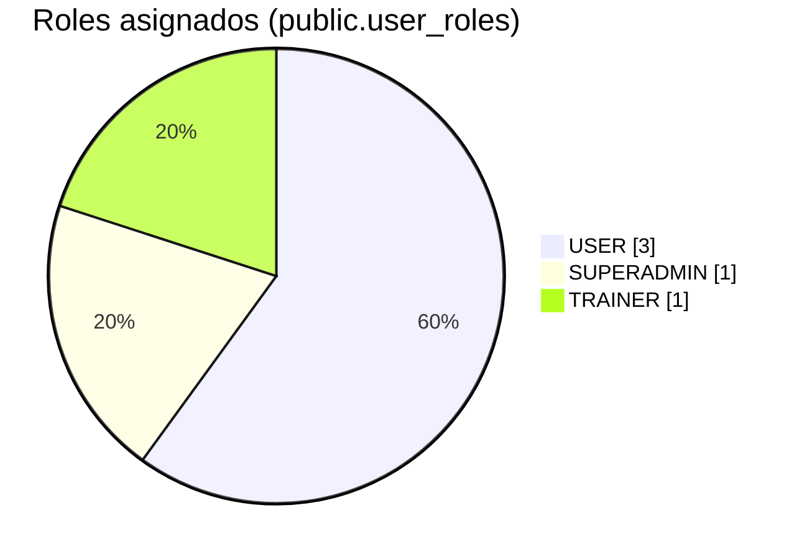
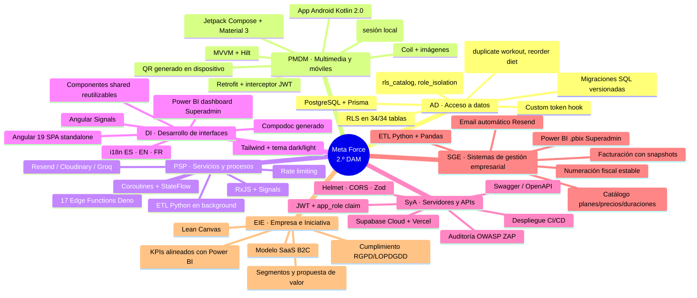
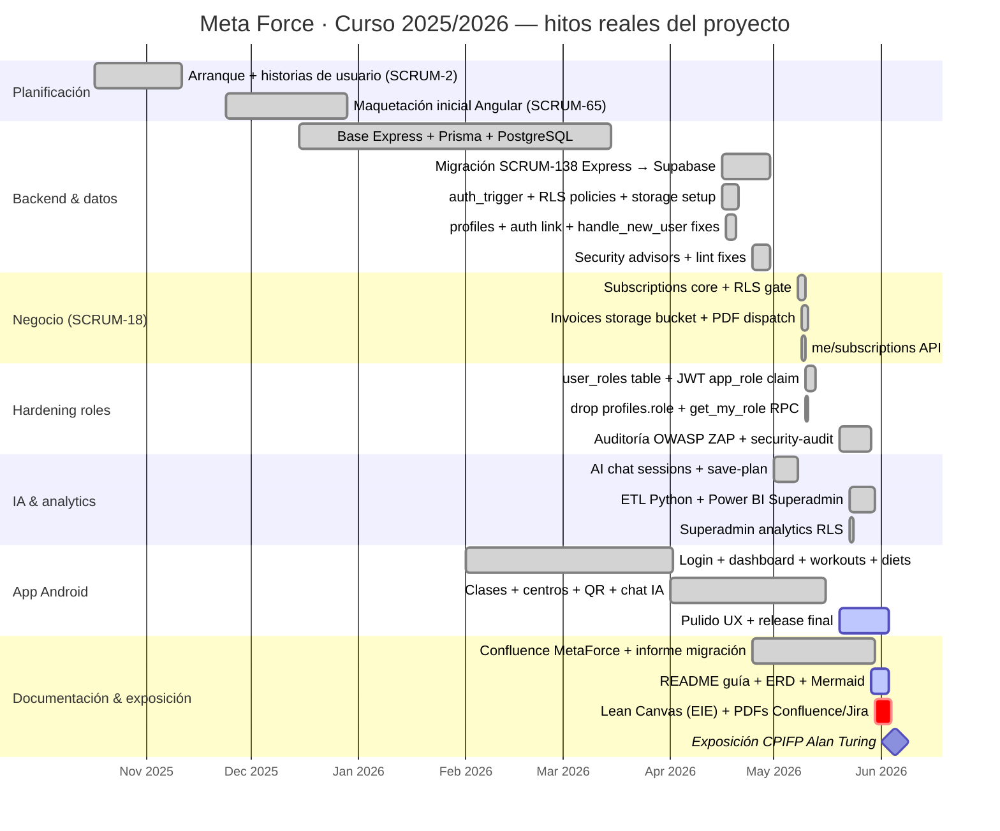
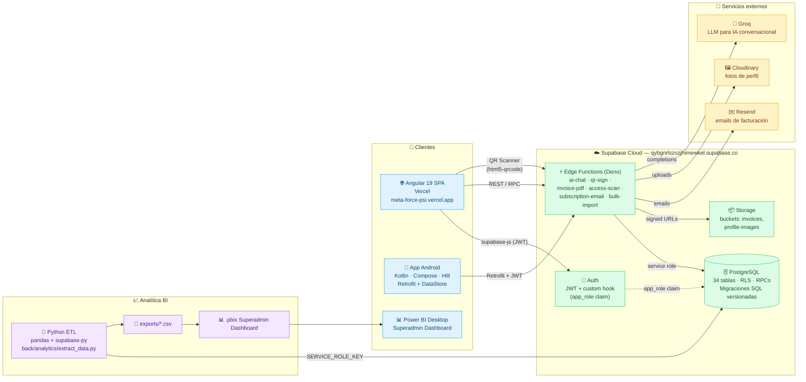
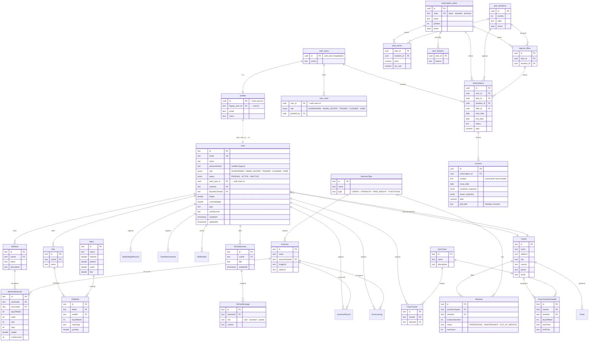
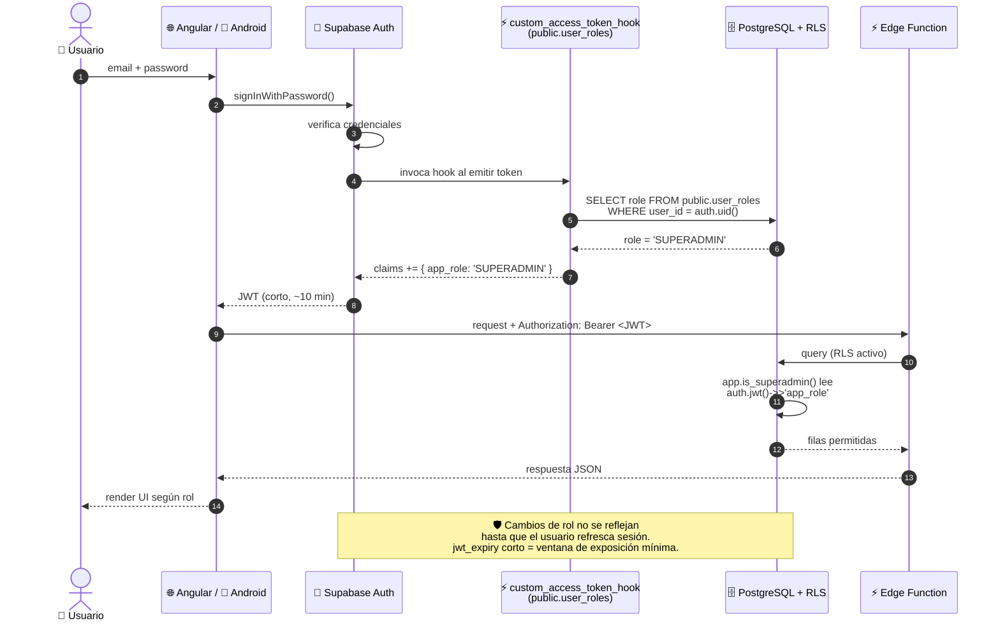
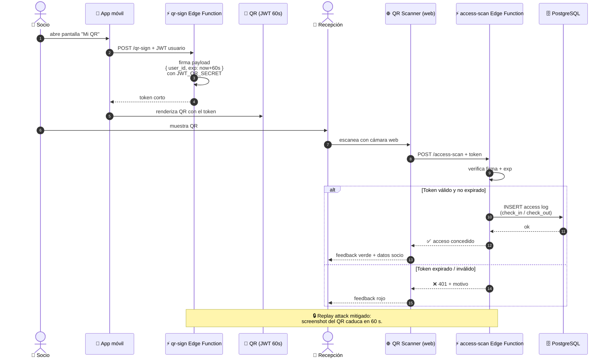
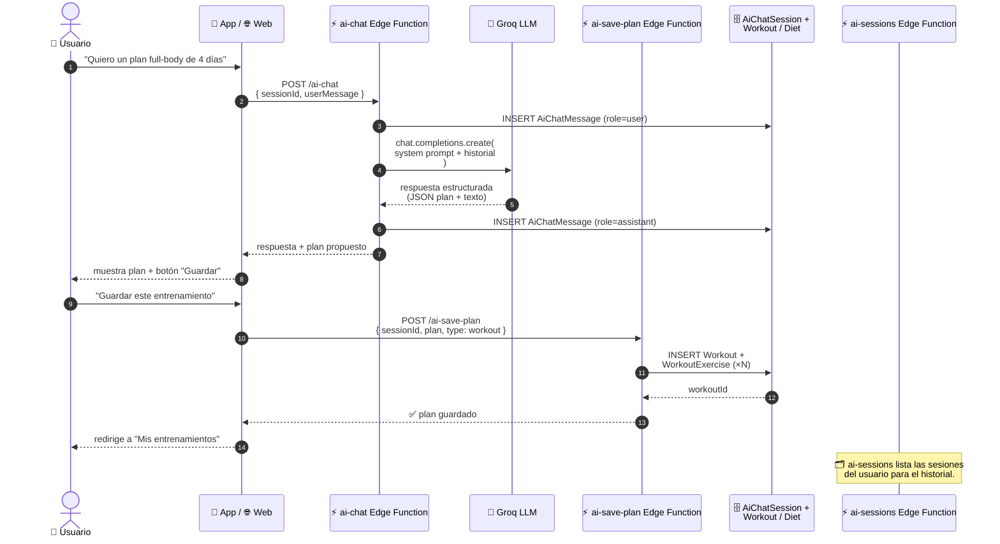

# Meta Force — Proyecto Intermodular 2.º DAM (CPIFP Alan Turing)

<div align="center">


**Plataforma integral de gestión de centros deportivos: web (Angular + Supabase), app Android (Kotlin/Jetpack Compose), IA asistente y analítica BI.**

[](https://meta-force-psi.vercel.app/)
[](https://github.com/Mariogarluu/Meta_Force_front)
[](https://github.com/Mariogarluu/Meta_Force_back)
[](https://github.com/Mariogarluu/Meta_Force_kotlin)

</div>

> Repositorio guía del **Grupo 5** del turno de mañana — exposición del **5 de junio de 2026, 10:00 – 10:15**. CPIFP Alan Turing (Málaga). Ciclo: Desarrollo de Aplicaciones Multiplataforma. Curso 2025/2026.

---

## Índice de contenidos

1. [Equipo](#equipo)
2. [Resumen del proyecto](#resumen-del-proyecto)
3. [El proyecto en cifras (producción)](#el-proyecto-en-cifras-producción)
4. [Capturas y vistas del producto](#capturas-y-vistas-del-producto)
5. [Aportación del proyecto por módulo](#aportación-del-proyecto-por-módulo)
   - [Acceso a datos (Juan Antonio García Gómez)](#acceso-a-datos--juan-antonio-garcía-gómez)
   - [Programación multimedia y dispositivos móviles (David Hormigo Ramírez)](#programación-multimedia-y-dispositivos-móviles--david-hormigo-ramírez)
   - [Programación de servicios y procesos (David Hormigo Ramírez)](#programación-de-servicios-y-procesos--david-hormigo-ramírez)
   - [Desarrollo de interfaces (Carmen Campos Fernández)](#desarrollo-de-interfaces--carmen-campos-fernández)
   - [Servidores y APIs (Juan Antonio García Gómez)](#servidores-y-apis--juan-antonio-garcía-gómez)
   - [Sistemas de gestión empresarial (Miguel Ángel Ronda Carracao)](#sistemas-de-gestión-empresarial--miguel-ángel-ronda-carracao)
   - [Empresa e Iniciativa Emprendedora II (Rosa Carmen Alcázar Rosal)](#empresa-e-iniciativa-emprendedora-ii--rosa-carmen-alcázar-rosal)
6. [Repositorios de código](#repositorios-de-código)
7. [Despliegue y entornos](#despliegue-y-entornos)
8. [Documentación unificada (Confluence)](#documentación-unificada-confluence)
9. [Gestión del proyecto (Jira)](#gestión-del-proyecto-jira)
10. [Documentación de código (Compodoc)](#documentación-de-código-compodoc)
11. [Roadmap del proyecto](#roadmap-del-proyecto)
12. [Stack tecnológico](#stack-tecnológico)
13. [Arquitectura y diagrama general](#arquitectura-y-diagrama-general)
14. [Cómo levantar el proyecto en local](#cómo-levantar-el-proyecto-en-local)
15. [Mapeo Rúbrica ↔ Evidencias](#mapeo-rúbrica--evidencias)
16. [Información que falta por aportar](#información-que-falta-por-aportar)

---

## Equipo

> Orden de exposición: **5** — bloque 10:00 → 10:15 del 5 de junio de 2026.

| Foto | Nombre completo | Correo educaAnd | Rol principal | GitHub |
|------|-----------------|------------------|---------------|--------|
| 🧑‍💻 | **Mario García Luque** | [mgarluq1102@g.educaand.es](mailto:mgarluq1102@g.educaand.es) | Tech lead · Backend Supabase, Edge Functions, RLS, CI/CD, analítica, app Kotlin | [@Mariogarluu](https://github.com/Mariogarluu) |
| 🧑‍💻 | **Salvador Bueno González** | [sbuegon0702@g.educaand.es](mailto:sbuegon0702@g.educaand.es) | Frontend Angular — maquetación, dashboard, i18n, temas | [@sbuegonz00](https://github.com/sbuegonz00) |
| 🧑‍💻 | **Samuel García Ruiz** | [sgarrui1201@g.educaand.es](mailto:sgarrui1201@g.educaand.es) | Frontend Angular — historias de usuario, gestión de centros / clases | [@sgarrui1201](https://github.com/sgarrui1201) |

Profesorado evaluador (5 de junio de 2026):

- García Gómez, Juan Antonio (coordinador, AD / SyA)
- Hormigo Ramírez, David (PSP / PMDM)
- Campos Fernández, Carmen (DI)
- Ronda Carracao, Miguel Ángel (SGE)
- Alcázar Rosal, Rosa Carmen (EIE)

---

## Resumen del proyecto

**Meta Force** es una **plataforma multicapa para la gestión de centros deportivos** que integra:

- 🌐 **Web (Angular 19 + Tailwind 3.4 + Supabase JS):** panel de administración para SUPERADMIN y ADMIN_CENTER (usuarios, centros, máquinas, clases, suscripciones, facturación) y portal de cliente (perfil, plan, QR, dashboard).
- 📱 **App Android (Kotlin 2.0 + Jetpack Compose + Hilt):** experiencia móvil para usuarios y entrenadores con entrenamientos, dietas, clases, QR de acceso y chat con IA.
- 🧠 **Asistente de IA (Edge Function `ai-chat` + Groq):** genera y guarda planes de entrenamiento / nutrición personalizados.
- 🔐 **Backend serverless Supabase:** PostgreSQL gestionado, **Row Level Security** por rol (`SUPERADMIN`, `ADMIN_CENTER`, `TRAINER`, `CLEANER`, `USER`), `Auth` con JWT + *custom access token hook*, *Storage* para facturas e imágenes, **Edge Functions** (Deno) que sustituyen al Express histórico.
- 📊 **Analítica BI (Power BI + Python/Pandas):** ETL contra Supabase (`back/analytics/extract_data.py`) que alimenta `MetaForce_Superadmin_Dashboard.pbix` con KPIs de negocio (usuarios, suscripciones, facturación, ocupación, entrenamientos).
- 🛡️ **Seguridad y auditoría:** Helmet + rate-limit en histórico Express, RLS exhaustivo en Supabase, JWT con expiry corto, **auditoría OWASP ZAP** documentada (`back/docs/ZAP_RUNBOOK_2026-05.md`, `back/docs/security-audit-2026-05.md`).

> El producto **está desplegado y accesible** en [https://meta-force-psi.vercel.app/](https://meta-force-psi.vercel.app/).
> El backend corre como proyecto Supabase (`https://qybgnrlszozjhimewkel.supabase.co`) con sus Edge Functions y políticas RLS aplicadas mediante migraciones SQL versionadas.

### Diferencial frente a un CRUD genérico

- **Migración real Express → Supabase** documentada en `back/docs/MIGRATION_DECISIONS.md` y trazada en Jira (épica **SCRUM-147 — Infraestructura y Ecosistema Meta-Force** y Confluence “Informe migración Express → Supabase — SCRUM-138”).
- **Control de acceso físico al gimnasio mediante QR firmado con JWT corto** (`qr-sign` + `access-scan` Edge Functions).
- **Suscripciones y facturación nativa** (`subscription_plans`, `plan_durations`, `plan_prices`, `subscriptions`, `invoices`) con generación de PDF (`invoice-pdf`) y envío automático por email vía Resend (`subscription-email`).
- **IA conversacional** con persistencia de sesiones (`AiChatSession`, `AiChatMessage`) y guardado directo de planes generados al perfil del usuario.

---

## El proyecto en cifras (producción)

> Datos leídos en vivo del proyecto Supabase (`qybgnrlszozjhimewkel.supabase.co`) en la fecha de cierre de esta documentación. Reproducible con `back/scripts/load-env.mjs` + `back/analytics/extract_data.py`.

### Volumen de datos

| Dominio | Tabla(s) | Registros |
|---------|----------|----------:|
| 👥 Usuarios autenticados | `User` + `profiles` + `user_roles` | **80 usuarios** · 5 perfiles enlazados a `auth.users` · 5 roles asignados |
| 🏢 Centros deportivos | `Center` | **8 centros** |
| 🏋️ Equipamiento | `Machine` + `MachineType` | 2 máquinas operativas sobre **14 tipos** modelados |
| 📅 Clases y horarios | `GymClass` + `ClassCenterSchedule` + `ClassTrainer` | **32 clases** con **1 024 ocurrencias programadas** y 77 asignaciones de entrenadores |
| 💪 Entrenamientos | `Workout` + `WorkoutExercise` + `Exercise` | 9 rutinas con **67 ejercicios encadenados** sobre un catálogo de **90 ejercicios** |
| 🥗 Nutrición | `Diet` + `DietMeal` + `Meal` | 4 dietas con 6 comidas asignadas (3 comidas en catálogo) |
| 🤖 IA conversacional | `AiChatSession` + `AiChatMessage` | **13 sesiones** con **26 mensajes** persistidos |
| 💳 Negocio | `subscription_plans` + `subscriptions` + `invoices` | **3 planes** (`basic` · `standard` · `premium`) · 3 suscripciones activas · **3 facturas emitidas con numeración fiscal estable** |
| ⚖️ Métricas físicas | `BodyWeightRecord` + `ExerciseRecord` | 6 registros de peso corporal · 4 marcas personales |

### Plataforma técnica

| Métrica | Valor |
|---------|------:|
| Tablas con RLS habilitado | **34 / 34** (100 %) |
| Migraciones SQL versionadas | **25+** en `back/supabase/migrations/` |
| Edge Functions desplegadas | **17** en `back/supabase/functions/` |
| Tests SQL (RLS, roles, facturación) | 5 suites en `back/supabase/tests/` |
| Tests E2E (smoke roles + SCRUM-18) | 2 en `back/tests/e2e/` |
| Issues totales en Jira `SCRUM` | hasta `SCRUM-180` |
| Épicas principales | 3 (Historias de usuario · Maquetación · Infraestructura) |
| Idiomas soportados (web) | 3 (ES · EN · FR) |
| Idiomas soportados (móvil) | 2 (ES · EN) |
| Build de producción | ✅ desplegado en Vercel (`meta-force-psi.vercel.app`) |

### Distribución de roles en producción



> El resto de los 80 registros en `public."User"` corresponde a usuarios legacy importados desde el `seed-from-json.mjs` y mapeados con `legacy_user_map`, aún pendientes de provisionar en `auth.users` y `user_roles`.

---

## Capturas y vistas del producto

### Identidad visual / brand assets

Activos disponibles directamente en los repositorios de cada capa:

<table>
  <tr>
    <td align="center" width="33%">
      <br/>
      <sub><b>Logo principal — web</b><br/><code>front/public/Logo.png</code></sub>
    </td>
    <td align="center" width="33%">
      <br/>
      <sub><b>Logo app Android</b><br/><code>kotlin/app/src/main/res/drawable/app_logo.png</code></sub>
    </td>
    <td align="center" width="33%">
      <br/>
      <sub><b>Launcher icon Android</b><br/><code>kotlin/app/src/main/res/mipmap-xxxhdpi/ic_launcher_round.png</code></sub>
    </td>
  </tr>
</table>

> El logo es el mismo *wordmark* en ambas plataformas (mancuerna con la **M** estilizada en gradiente azul → cian), lo que garantiza coherencia visual entre la app web y la móvil.

### Capturas de pantalla del producto

Las capturas en vivo del producto se almacenan en [`readme/img/`](./img/) y se incrustarán a continuación. Los íconos / favicon / Compodoc ya existen en los submódulos y no requieren regenerarse.

| # | Vista | Origen | Estado |
|---|-------|--------|--------|
| 1 | Landing / login (web) | `readme/img/01-landing.png` | ⏳ pendiente |
| 2 | Dashboard SUPERADMIN (web) | `readme/img/02-dashboard.png` | ⏳ pendiente |
| 3 | Gestión de centros / máquinas (web) | `readme/img/03-centros.png` | ⏳ pendiente |
| 4 | Suscripciones y facturación (web) | `readme/img/04-suscripciones.png` | ⏳ pendiente |
| 5 | Lector / generador de QR (web + móvil) | `readme/img/05-qr.png` | ⏳ pendiente |
| 6 | Chat con IA y planes (móvil) | `readme/img/06-ai-chat.png` | ⏳ pendiente |
| 7 | Dashboard Power BI (analytics) | `readme/img/07-powerbi.png` | ⏳ pendiente |
| 8 | Diagrama de arquitectura | `readme/img/08-arquitectura.png` | ⏳ pendiente |
| 9 | Lean Canvas (EIE) | `readme/img/09-lean-canvas.png` | ⏳ pendiente |
| — | Compodoc (front) | [`front/documentation/`](../front/documentation/) (`index.html`, `coverage.html`, `modules.html`, `routes.html`) | ✅ generado en repo |
| — | Favicon web | [`front/public/favicon.ico`](../front/public/favicon.ico) | ✅ en repo |

> ⚠️ **Pendiente:** subir las capturas reales 1–9 al directorio `readme/img/`. (Ver [Información que falta por aportar](#información-que-falta-por-aportar).)

---

## Aportación del proyecto por módulo

Subapartado obligatorio por cada módulo (con objetivos cubiertos, evidencias en el repo y limitaciones / líneas futuras).

### Mapa de integración módulos ↔ features

Visualización del criterio **“Integración multi-módulo”** de la rúbrica: cada rama es un módulo del ciclo y los hijos son las features concretas del proyecto que materializan sus competencias.



### Acceso a datos — Juan Antonio García Gómez

**Objetivos del módulo cubiertos**

- Modelado de datos relacional sobre PostgreSQL (Supabase).
- Persistencia ORM con **Prisma 6.18** en el histórico Express y mantenida como *source of truth* declarativa: [`back/prisma/schema.prisma`](../back/prisma/schema.prisma).
- Migraciones versionadas en **SQL puro** (Supabase) en [`back/supabase/migrations/`](../back/supabase/migrations/) (20+ migraciones aplicadas: triggers de `auth.users → public.profiles`, RLS, custom access token hook, RPC para duplicar entrenamientos, facturación, roles, *security advisors fixes*…).
- Procedimientos almacenados / RPC para reordenar dietas y duplicar workouts ([`20260418104000_rpc_duplicate_workout_reorder_diet.sql`](../back/supabase/migrations/20260418104000_rpc_duplicate_workout_reorder_diet.sql)).
- Consumo desde múltiples clientes: Angular (Supabase JS), Kotlin/Retrofit (REST a Edge Functions), Python (`supabase-py` para ETL).
- **34 tablas en producción** con RLS habilitado en todas: `User`, `Center`, `Machine`, `GymClass`, `ClassCenterSchedule` (1.024 filas), `subscriptions`, `invoices`, `user_roles`, `AiChatSession`, `Workout`, `Diet`, etc.

**Evidencias en el repo**

- 📄 `back/prisma/schema.prisma` — modelo lógico (User, Center, Machine, GymClass, Subscription, Invoice, Workout, Diet, AiChat…).
- 📂 `back/supabase/migrations/` — migraciones SQL con histórico completo (RLS, índices, FKs, RPC, triggers).
- 📂 `back/supabase/tests/` — tests SQL (`rls_catalog.test.sql`, `role_isolation.test.sql`, `subscriptions_chain.test.sql`, `invoice_numbering.test.sql`, `admin_set_user_role.test.sql`).
- 📄 `back/scripts/seed-from-json.mjs` y `back/JSON_IMPORT_GUIDE.md` — carga masiva tipada desde JSON.
- 📄 `back/docs/MIGRATION_DECISIONS.md` — decisiones técnicas de la migración Express/Prisma → Supabase.

**Limitaciones / líneas futuras**

- Vistas materializadas para reporting BI en lugar del ETL nocturno.
- Particionamiento de tablas históricas (`ClassCenterSchedule`, `ExerciseLog`).

---

### Programación multimedia y dispositivos móviles — David Hormigo Ramírez

<p align="left">
  
</p>

**Objetivos del módulo cubiertos**

- App **Android nativa** en **Kotlin 2.0** con **Jetpack Compose + Material Design 3** ([`kotlin/`](../kotlin/)).
- Arquitectura **MVVM + Clean Architecture** con **Dagger Hilt** para inyección de dependencias.
- **Persistencia local** con Jetpack DataStore (sesión y preferencias).
- Consumo de **API REST con Retrofit 2 + OkHttp3** (interceptor de auth con JWT).
- **Asincronía** con Kotlin Coroutines + StateFlow.
- Generación de **código QR** en el dispositivo y subida de imágenes con **Coil**.
- Pantallas: login/registro, dashboard, entrenamientos (lista + detalle), dietas, clases grupales, centros y equipamiento, perfil, **chat con IA** y QR personal.

**Evidencias en el repo**

- 📄 [`kotlin/README.md`](../kotlin/README.md) — arquitectura, stack, endpoints consumidos, paleta visual.
- 📂 `kotlin/app/src/main/java/com/meta_force/meta_force/` — capa `data/` (model, network, repository), `di/`, `ui/` (auth, dashboard, workouts, diets, classes, centers, aichat, qr, profile).
- 📄 `kotlin/app/src/main/java/com/meta_force/meta_force/di/NetworkModule.kt` — `BASE_URL` apuntando al backend desplegado.

**Limitaciones / líneas futuras**

- Modo offline-first con Room y sincronización en background.
- Notificaciones push con FCM (recordatorios de clases / suscripciones).

---

### Programación de servicios y procesos — David Hormigo Ramírez

**Objetivos del módulo cubiertos**

- Servicios concurrentes y procesos **serverless en Deno** (Edge Functions de Supabase): autenticación, escaneo QR, generación de PDFs, envío de emails, importación masiva, IA, eventos de rendimiento, *health checks*…
- **11 Edge Functions desplegadas** en [`back/supabase/functions/`](../back/supabase/functions/): `auth-register`, `auth-change-password`, `admin-signout`, `admin-analytics`, `access-scan`, `qr-sign`, `bulk-import`, `migrate-legacy-users`, `invoice-pdf`, `subscription-email`, `ai-chat`, `ai-save-plan`, `ai-sessions`, `create-ticket`, `machines-create`, `performance-events`, `health`.
- **Procesos largos** (importación masiva, ETL analítico) ejecutados como tareas Python/Node fuera del request HTTP (`back/scripts/seed-from-json.mjs`, `back/analytics/extract_data.py`).
- **Hilos / coroutines** en la app Kotlin (Coroutines + StateFlow) y **operadores reactivos** con RxJS en Angular.
- **Rate limiting** en el histórico Express (`express-rate-limit`) y en Edge (helper `back/supabase/functions/_shared/rate-limit.ts`).
- Comunicación entre procesos vía **Resend** (email) y **Cloudinary** (`back/src/services/cloudinary.service.ts`) para imágenes.

**Evidencias en el repo**

- 📂 `back/supabase/functions/` — código fuente Deno de cada función.
- 📄 `back/supabase/functions/_shared/rate-limit.ts`, `cors.ts`, `groq.ts`, `supabase-admin.ts` — helpers compartidos.
- 📄 `back/src/middleware/auth.ts`, `back/src/middleware/checkCenterAccess.ts` — middlewares del histórico Express.

**Limitaciones / líneas futuras**

- Mover importaciones masivas a colas (`pg_cron` + función background).
- Telemetría OpenTelemetry exportada a Datadog/Sentry.

---

### Desarrollo de interfaces — Carmen Campos Fernández

**Objetivos del módulo cubiertos**

- **SPA Angular 19.2 standalone components** con routing, guards (`auth`, `guest`, `role`) e interceptores HTTP en [`front/`](../front/).
- **Diseño responsive y accesible** con **Tailwind CSS 3.4**, modo claro/oscuro persistente y tipografía / paleta coherente.
- **Internacionalización (i18n)** con `ngx-translate` en tres idiomas: ES, EN, FR (`front/public/assets/i18n/`).
- **Componentes reutilizables**: `navbar`, `footer`, `language-selector`, `theme-toggle`, `profile-image-manager`, `error-toast`.
- **Gestión de estado reactivo** con Angular Signals + RxJS.
- **Cuadro de mando ejecutivo en Power BI** (`back/analytics/Power_Bi/MetaForce_Superadmin_Dashboard.pbix`) consumiendo los CSV exportados desde Supabase con KPIs visuales para el SUPERADMIN (usuarios activos, planes contratados, ingresos por centro, ocupación de clases, evolución de peso corporal, etc.).
- Estados de carga, vacío, error y éxito modelados con componentes y signals.

**Evidencias en el repo**

- 📂 `front/src/app/pages/` — `home`, `login`, `register`, `dashboard`, `users`, `centers`, `machines`, `clases`, `trainers`, `qr`, `qr-scanner`.
- 📂 `front/src/app/shared/components/` — componentes compartidos.
- 📂 `front/public/assets/i18n/` — `es.json`, `en.json`, `fr.json`.
- 📄 `front/docs/FE-ARCHITECTURE.md` — arquitectura del frontend.
- 📄 `back/analytics/Power_Bi/MetaForce_Superadmin_Dashboard.pbix` — dashboard Power BI.
- 📂 `front/documentation/` — Compodoc generado (componentes, módulos, rutas, *coverage*).

**Limitaciones / líneas futuras**

- Auditoría WCAG AA completa (en curso, ZAP cubre solo seguridad).
- Storybook / Playroom para catálogo visual del sistema de diseño.

---

### Servidores y APIs — Juan Antonio García Gómez

**Objetivos del módulo cubiertos**

- **API REST documentada con Swagger / OpenAPI** (histórico Express: `back/src/config/swagger.ts`).
- **Backend serverless Supabase** con Edge Functions desplegadas en `https://qybgnrlszozjhimewkel.supabase.co/functions/v1/<name>`.
- **Autenticación JWT** con Supabase Auth + **custom access token hook** (`public.custom_access_token_hook`) que inyecta `app_role` como claim, evitando confiar en `user_metadata`.
- **Autorización por RLS** en todas las tablas con helpers `app.is_staff()` / `app.is_superadmin()` que leen `auth.jwt()->>'app_role'`.
- **Seguridad HTTP**: Helmet, CORS por origen, *rate-limit*, validación Zod en cada endpoint, hashing bcrypt para legacy.
- **Auditoría de seguridad OWASP ZAP** documentada (`back/docs/ZAP_RUNBOOK_2026-05.md`, `back/docs/security-audit-2026-05.md`, contexto en `back/zap/`).
- **Despliegue Vercel** para Angular (`https://meta-force-psi.vercel.app/`) y Supabase Cloud para backend.
- **Versionado** con Git + GitHub (un repositorio por capa) y CI/CD.

**Evidencias en el repo**

- 📄 `back/src/app.ts`, `back/src/index.ts`, `back/src/config/swagger.ts` — bootstrap del Express histórico.
- 📂 `back/src/modules/` — `auth`, `users`, `centers`, `machines`, `memberships`, `exercises`, `workouts`, `diets`, `access` (controladores + servicios + esquemas Zod).
- 📂 `back/supabase/functions/` — endpoints serverless en producción.
- 📄 `back/docs/ARCHITECTURE.md` — arquitectura del backend.
- 📄 `back/SECRETS.md` — guía de variables de entorno y secretos.
- 📄 `back/docs/security-audit-2026-05.md` — informe de auditoría.

**Limitaciones / líneas futuras**

- Migrar Swagger a OpenAPI 3.1 servido desde Edge Function `health` para que apunte siempre al runtime activo.
- Pruebas de carga (k6 / Artillery) sobre las Edge Functions críticas.

---

### Sistemas de gestión empresarial — Miguel Ángel Ronda Carracao

**Objetivos del módulo cubiertos**

- Modelo de **negocio SaaS B2C** sobre el dominio gimnasio: catálogo de planes (`subscription_plans`), duraciones (`plan_durations`), precios (`plan_prices`), **facturación con numeración estable** (`invoices` + test `invoice_numbering.test.sql`), entidad fiscal emisora (`issuer_settings`), ofertas (`special_offers`).
- Flujo completo de **alta → suscripción → factura PDF → email**: Edge Functions `subscription-email` e `invoice-pdf` + bucket `invoices` en Supabase Storage (`20260509120000_invoices_storage_bucket.sql`).
- **ETL en Python** (`back/analytics/extract_data.py`) con `pandas` + `supabase-py` que extrae tablas core (`User`, `BodyWeightRecord`, `Exercise`, `ExerciseRecord`, `user_roles`, `subscription_plans`, `plan_durations`, `subscriptions`, `invoices`) y las vuelca a CSV en `back/analytics/exports/` para alimentar Power BI.
- **Cuadro de mando ejecutivo en Power BI** (`MetaForce_Superadmin_Dashboard.pbix`) con KPIs operativos y financieros del negocio: usuarios, planes contratados, ingresos, ocupación, retención.
- **Trazabilidad financiera**: `invoice_numbering.test.sql`, `subscriptions_chain.test.sql`.

**Evidencias en el repo**

- 📂 `back/analytics/` — `extract_data.py`, `requirements.txt`, `exports/*.csv`, `Power_Bi/MetaForce_Superadmin_Dashboard.pbix`.
- 📄 `back/scripts/apply-analytics-rls.js` — políticas RLS para los roles analíticos.
- 📄 Migraciones SCRUM-18: `back/supabase/migrations/20260508213746_subscriptions_core.sql`, `20260508214606_subscriptions_rls_gate.sql`, `20260509120000_invoices_storage_bucket.sql`, `20260509121000_invoice_pdf_email_dispatch.sql`, `20260509123000_me_subscriptions_api.sql`.
- 📂 `back/supabase/tests/` — `invoice_numbering.test.sql`, `subscriptions_chain.test.sql`.

**Limitaciones / líneas futuras**

- Conector directo de Power BI a PostgreSQL/Supabase con refresco programado (hoy se trabaja con CSV).
- Cuentas analíticas separadas con RLS específico para `data-analyst`.

---

### Empresa e Iniciativa Emprendedora II — Rosa Carmen Alcázar Rosal

**Objetivos del módulo cubiertos**

- **Modelo de negocio formalizado con Lean Canvas** para Meta Force como producto SaaS B2C dirigido a centros deportivos y a sus socios.
- Identificación de **segmentos de clientes** (gimnasios independientes, cadenas pequeñas/medianas, usuarios finales), **propuesta de valor diferencial** (control de acceso QR + IA + analítica + multiplataforma web/Android), **canales** (web, app, comercial directo), **flujo de ingresos** (suscripciones mensuales/anuales por centro y add-ons IA) y **estructura de costes** (Supabase, Vercel, Resend, Groq, Cloudinary).
- **Métricas clave (KPIs)** alineadas con la solución técnica: usuarios activos, accesos QR/día, ratio de conversión a plan de pago, MRR, churn — todas observables desde el **dashboard Power BI Superadmin** del módulo SGE.
- **Ventaja injusta**: integración nativa de IA conversacional y dashboard analítico listo para uso del centro desde el primer día, frente a competidores que requieren contratar BI externo.
- Reflexión sobre **viabilidad económica, legal y de mercado** del producto: tratamiento de datos personales (LOPDGDD/RGPD), cumplimiento mediante RLS + JWT, auditoría OWASP ZAP documentada y emisión de facturas con numeración fiscal estable (`issuer_settings`, `invoices`).

**Evidencias en el repo**

- 📄 **Lean Canvas:** `readme/docs/Meta-Force_Lean_Canvas.pdf` *(pendiente de subir)* — versión consolidada del canvas completado en clase.
- 📄 Resumen de modelo de negocio embebido en el PDF de Confluence (`readme/docs/Meta-Force_Confluence.pdf`, pendiente).
- 🔗 Trazabilidad con la implementación real: el **catálogo de planes y precios** (`subscription_plans`, `plan_durations`, `plan_prices`), el **flujo de facturación automatizado** (`invoice-pdf`, `subscription-email`, bucket `invoices`) y los **KPIs** del Power BI son la materialización técnica del Lean Canvas.

**Limitaciones / líneas futuras**

- Validación con clientes reales (entrevistas a gimnasios locales) — pendiente para un siguiente sprint comercial.
- Plan financiero a 3 años con escenarios *best / base / worst case* a partir de los datos reales del dashboard Power BI.

---

## Repositorios de código

| Capa | Repositorio | Tecnologías |
|------|-------------|-------------|
| Frontend web | [`Mariogarluu/Meta_Force_front`](https://github.com/Mariogarluu/Meta_Force_front) | Angular 19 · TypeScript 5.7 · Tailwind 3.4 · ngx-translate · Supabase JS |
| Backend (Supabase + histórico Express) | [`Mariogarluu/Meta_Force_back`](https://github.com/Mariogarluu/Meta_Force_back) | Supabase (PostgreSQL · Edge Functions Deno · Auth · Storage) · Prisma · Express 5 |
| App Android | [`Mariogarluu/Meta_Force_kotlin`](https://github.com/Mariogarluu/Meta_Force_kotlin) | Kotlin 2.0 · Jetpack Compose · Hilt · Retrofit · DataStore |
| Analítica BI | Carpeta [`back/analytics/`](../back/analytics/) en el repo de backend | Python · Pandas · `supabase-py` · Power BI |

> Cada capa se desarrolla y despliega de forma **independiente** desde su propio repositorio: los tres repos anteriores son la fuente de verdad.

---

## Despliegue y entornos

| Componente | URL / referencia | Observaciones |
|------------|------------------|---------------|
| **Web producción** | <https://meta-force-psi.vercel.app/> | Desplegada en Vercel. SPA con `vercel.json` reescrito para rutas Angular. |
| **API Supabase** | `https://qybgnrlszozjhimewkel.supabase.co` | Edge Functions en `/functions/v1/<name>`. RLS activo. |
| **App Android** | APK / Bundle | *Pendiente:* enlace al release en GitHub. |
| **Compodoc** | `front/documentation/` | *Pendiente:* desplegar como sitio estático accesible durante la evaluación. |

### Credenciales de prueba para evaluación

> ⚠️ **Pendiente:** generar usuarios de prueba (SUPERADMIN, ADMIN_CENTER y CLIENT) y publicarlos aquí. (Ver [Información que falta por aportar](#información-que-falta-por-aportar).)

```
SUPERADMIN  → email: __PENDIENTE__   password: __PENDIENTE__
ADMIN_CENTER → email: __PENDIENTE__  password: __PENDIENTE__
CLIENT      → email: __PENDIENTE__   password: __PENDIENTE__
```

---

## Documentación unificada (Confluence)

El espacio de documentación del proyecto vive en Confluence:

- **Espacio:** [Meta-Force (`MetaForce`)](https://meta-force.atlassian.net/wiki/spaces/MetaForce) (ID `196612`).
- **Home del espacio:** [Meta-Force — Home](https://meta-force.atlassian.net/wiki/spaces/MetaForce/pages/196720/Meta-Force).
- **Informe de migración Express → Supabase (SCRUM-138):** [enlace a Confluence](https://meta-force.atlassian.net/wiki/spaces/MetaForce/pages/10420225/Informe+migración+Express+→+Supabase+—+Sprint+actual+SCRUM-138+-+2026-04-25).

📄 **PDF unificado de la documentación:** `readme/docs/Meta-Force_Confluence.pdf` *(pendiente de generar y subir)*.

> El PDF debe consolidar las páginas del espacio Confluence `MetaForce` (arquitectura, migraciones, decisiones técnicas, runbooks de seguridad ZAP, notas de release).

---

## Gestión del proyecto (Jira)

- **Proyecto Jira:** `SCRUM` — *meta-force* en `https://meta-force.atlassian.net`.
- **Última issue creada al cierre de esta documentación:** `SCRUM-180`.
- **Épicas principales:**
  - [`SCRUM-2` — Historias_Usuario](https://meta-force.atlassian.net/browse/SCRUM-2) — owner: Samuel García Ruiz.
  - [`SCRUM-65` — Maquetación](https://meta-force.atlassian.net/browse/SCRUM-65) — owner: Salvador Bueno González.
  - [`SCRUM-147` — Infraestructura y Ecosistema Meta-Force](https://meta-force.atlassian.net/browse/SCRUM-147) — owner: Mario García Luque.
- **Tipos de issue usados:** Epic, Historia, Tarea, Subtarea, Error, *kotlin* (custom para el módulo Android).
- **Iteraciones destacadas:** SCRUM-18 (suscripciones + facturación + QR firmado), SCRUM-138 (migración Express → Supabase), hardening de roles y RLS.

📄 **PDF resumen de gestión Jira:** `readme/docs/Meta-Force_Jira.pdf` *(pendiente de generar y subir)*.

> El PDF debe incluir, como mínimo: alcance del proyecto, listado de épicas, tablero (To Do / In Progress / Done), reparto de tareas por persona (Mario, Salvador, Samuel), estado de cierre y *burndown* del sprint final.

---

## Documentación de código (Compodoc)

La documentación técnica del frontend Angular se genera con **Compodoc** y queda versionada en el directorio [`front/documentation/`](../front/documentation/) del repositorio de frontend.

- Genera la documentación:

```bash
cd front
npx @compodoc/compodoc -p tsconfig.doc.json -d documentation
```

- Sirve la documentación localmente durante la defensa:

```bash
cd front
npx @compodoc/compodoc -s -d documentation -r 8080
```

- 🌐 **Servidor Compodoc desplegado:** *pendiente* (URL pública estable que estará activa durante el periodo de evaluación). Ver [Información que falta por aportar](#información-que-falta-por-aportar).

> Compodoc cubre componentes, módulos, servicios, guards, interceptores, rutas y *coverage* de comentarios JSDoc del frontend Angular.

---

## Roadmap del proyecto

Línea temporal real basada en las **fechas de las migraciones SQL** (`back/supabase/migrations/`) y los hitos documentados en Confluence / Jira. Va desde el arranque del curso hasta la exposición del 5 de junio de 2026.



> El marcador rojo de `todayMarker` aparece automáticamente en GitHub sobre la fecha actual cuando renderiza el diagrama, lo que da una sensación visual inmediata del avance al tribunal.

---

## Stack tecnológico

### Frontend web — Angular 19

| Tecnología | Versión | Propósito |
|-----------|---------|-----------|
| Angular | 19.2 | Framework SPA standalone |
| TypeScript | 5.7 | Lenguaje |
| Tailwind CSS | 3.4 | Estilos utility-first + tema dark/light |
| RxJS · Signals | 7.8 / 19 | Estado reactivo |
| ngx-translate | 17.0 | i18n (ES / EN / FR) |
| html5-qrcode | 2.3 | Generación y escaneo QR |
| @supabase/supabase-js | latest | Cliente Auth + DB + Storage |
| Compodoc | — | Documentación de código |

### Backend — Supabase + Express histórico

| Tecnología | Versión | Propósito |
|-----------|---------|-----------|
| Supabase PostgreSQL | 15 | Base de datos gestionada |
| Supabase Auth | — | JWT + custom hook `app_role` |
| Supabase Storage | — | Buckets `invoices`, `profile-images` |
| Supabase Edge Functions | Deno 1.x | Endpoints serverless TS |
| Prisma | 6.18 | Modelo de datos declarativo |
| Express | 5.1 | Servicio histórico (legacy) |
| Zod | 4.1 | Validación de entrada |
| Helmet · CORS · rate-limit | — | Hardening HTTP |
| Winston | 3.18 | Logging |
| Jest | 30.2 | Test runner |
| OWASP ZAP | — | Auditoría de seguridad |

### App Android — Kotlin

| Tecnología | Propósito |
|-----------|-----------|
| Kotlin 2.0 + Jetpack Compose | UI declarativa Material 3 |
| Dagger Hilt | Inyección de dependencias |
| Retrofit 2 + OkHttp3 + Gson | Cliente HTTP REST |
| Jetpack DataStore | Persistencia local de sesión |
| Coroutines + StateFlow | Asincronía y estado |
| Coil | Carga de imágenes |
| Android API 26 → 36 | Compatibilidad |

### Analítica BI

| Tecnología | Propósito |
|-----------|-----------|
| Python 3 + Pandas | ETL contra Supabase |
| supabase-py | Cliente Supabase para Python |
| Power BI Desktop | Cuadro de mando Superadmin |

---

## Arquitectura y diagrama general



> Detalle completo: [`back/docs/ARCHITECTURE.md`](../back/docs/ARCHITECTURE.md) y [`front/docs/FE-ARCHITECTURE.md`](../front/docs/FE-ARCHITECTURE.md).

### Modelo de datos (ERD)

Diagrama generado a partir del esquema **real** de Supabase (`public.*`, leído en vivo vía `information_schema`), no del `schema.prisma` (que está desactualizado tras la migración SCRUM-138). Refleja el **doble sistema de identidad** del sistema:

- 🔵 **Bloque legacy** (Prisma): tablas con `id text`, dominio de gimnasio (`User`, `Center`, `Workout`, `Diet`, `AiChatSession`…).
- 🟢 **Bloque Supabase Auth** (UUID): `auth.users` → `profiles` ↔ `user_roles` ↔ `subscriptions` ↔ `invoices`.
- 🌉 **Puente** entre ambos: `User.auth_user_id (uuid)` ↔ `profiles.id (uuid)` y `profiles.legacy_user_id (text)` ↔ `User.id`.



> **Notas de diseño** (puntos extra para “honestidad sobre límites técnicos”):
>
> - El **doble ID** es deuda técnica heredada de la migración Express/Prisma → Supabase Auth: el dominio de gimnasio mantiene `text` para no romper FKs y los nuevos módulos (Auth, suscripciones, facturación) ya usan `uuid` nativo. Línea futura: unificar todo a `uuid` cuando el legado se haya provisionado al 100 % en `auth.users`.
> - El rol vive en `public.user_roles` (no en `user_metadata`) y se inyecta como claim `app_role` mediante el *custom access token hook* `public.custom_access_token_hook`. Las políticas RLS leen ese claim, no la tabla, para evitar un round-trip por cada query.
> - Las **facturas almacenan snapshots** (`customer_snapshot`, `issuer_snapshot` en `jsonb`) para garantizar trazabilidad fiscal aunque los datos del cliente o del emisor cambien después.

### Flujos críticos (sequence diagrams)

#### A · Autenticación con *custom access token hook*

El **rol jamás se lee de `user_metadata`** (vector de manipulación clásico): se persiste en `public.user_roles` y se inyecta como claim `app_role` en cada JWT, que es lo que las políticas RLS leen vía `auth.jwt()->>'app_role'`.



#### B · Control de acceso al gimnasio mediante QR firmado con JWT corto

El QR del socio no es un identificador estático — **es un JWT firmado con `JWT_QR_SECRET` y expira en segundos**, por lo que un screenshot del QR no sirve para entrar después.



#### C · Asistente de IA: chat + generación y guardado de plan

Una conversación con el coach IA puede convertirse en un entrenamiento o dieta **persistido en el usuario** con un solo click, sin que el cliente tenga que reescribir nada — la transformación ocurre en backend.



---

## Cómo levantar el proyecto en local

Clona cada repositorio por separado:

```bash
# 1. Frontend
git clone https://github.com/Mariogarluu/Meta_Force_front.git
cd Meta_Force_front
cp .env.example .env   # configurar SUPABASE_URL y ANON KEY
npm install
npm start              # http://localhost:4200

# 2. Backend Supabase (opcional, en local)
git clone https://github.com/Mariogarluu/Meta_Force_back.git
cd Meta_Force_back
cp .env.example .env   # rellenar DATABASE_URL, SUPABASE_SERVICE_ROLE_KEY, JWT_QR_SECRET, RESEND_*
npm install
npx supabase start
npx supabase db push
npx supabase functions deploy

# 3. App Android
git clone https://github.com/Mariogarluu/Meta_Force_kotlin.git
#   Abrir el proyecto con Android Studio (JDK 17, SDK 26+)
#   Ajustar BASE_URL en di/NetworkModule.kt si apunta a otro entorno
#   Run ▶

# 4. Analytics (Power BI ETL) — vive dentro del repo de backend
cd Meta_Force_back/analytics
pip install -r requirements.txt
python extract_data.py   # genera CSV en exports/
#   Abrir Power_Bi/MetaForce_Superadmin_Dashboard.pbix y refrescar fuentes
```

> Los detalles de despliegue, secretos y troubleshooting están en el README de cada repositorio: [Meta_Force_front](https://github.com/Mariogarluu/Meta_Force_front), [Meta_Force_back](https://github.com/Mariogarluu/Meta_Force_back), [Meta_Force_kotlin](https://github.com/Mariogarluu/Meta_Force_kotlin).

---

## Mapeo Rúbrica ↔ Evidencias

Tabla diseñada para que **el tribunal** localice rápidamente las evidencias de cada criterio de la rúbrica oficial de las exposiciones del 5 de junio de 2026 (CPIFP Alan Turing — 2.º DAM mañana).

| # | Criterio de la rúbrica | Dónde se demuestra en este proyecto |
|---|------------------------|--------------------------------------|
| 1 | **Exposición oral y estructura** (claridad, orden, tiempo ≤15 min, reparto en equipo) | Guion minutado del bloque 10:00–10:15 — ver [Equipo](#equipo) y la sección final “Plan de demo” (pendiente, ver [Información que falta](#información-que-falta-por-aportar)). Reparto explícito de los 3 miembros del equipo. |
| 2 | **Demostración técnica** (coherencia con discurso, estabilidad, plan B) | Demo en vivo sobre [meta-force-psi.vercel.app](https://meta-force-psi.vercel.app/) + APK Android + Power BI Desktop. Plan B: vídeo demo grabado *(pendiente)* y datos de prueba ya sembrados (`back/scripts/seed-from-json.mjs`, 80 usuarios y 1.024 horarios reales). |
| 3 | **Usabilidad de la aplicación** (navegación, feedback, accesibilidad básica, flujos críticos) | Componentes Angular con estados de carga/vacío/error (`error-toast`, `notification.service.ts`), guards de ruta (`auth`, `guest`, `role`), mensajes traducidos a 3 idiomas (`front/public/assets/i18n/`). En móvil, MVVM con `StateFlow` y feedback Material 3 (`kotlin/app/src/main/java/.../ui/`). |
| 4 | **Apariencia (UI/UX)** (tipografía, color, espaciado, estados, coherencia visual) | Identidad visual unificada web+móvil ([sección Identidad visual](#identidad-visual--brand-assets)), Tailwind 3.4 + tema claro/oscuro persistente, Material Design 3 en Android, paleta documentada en `kotlin/README.md`. |
| 5 | **Dificultad técnica e implementación** (arquitectura, integraciones, despliegue, calidad, CI/CD, seguridad) | Migración real Express→Supabase (`back/docs/MIGRATION_DECISIONS.md`), 34 tablas con RLS al 100 %, 17 Edge Functions Deno, JWT con *custom access token hook*, QR firmado con JWT corto, facturación con numeración fiscal estable, ETL Python a Power BI. Ver [Arquitectura](#arquitectura-y-diagrama-general) y [El proyecto en cifras](#el-proyecto-en-cifras-producción). |
| 6 | **Calidad de la documentación** (README según guía, PDF unificado, trazabilidad módulo↔evidencias, enlaces/imágenes válidos) | Este `readme/README.md` cumple la guía punto por punto: índice, equipo, descripción + imágenes referenciadas con rutas relativas, [subapartado por cada módulo con evidencias enlazadas](#aportación-del-proyecto-por-módulo), enlaces a repos, producción, Confluence, Jira, Compodoc. |
| 7 | **Gestión de proyecto (Jira)** (alcance, epics, reparto, estado de tareas; coherencia con entregable) | Proyecto Jira `SCRUM` (`https://meta-force.atlassian.net`), 3 épicas con responsables claros (SCRUM-2, SCRUM-65, SCRUM-147), hasta `SCRUM-180`, tipos custom para módulo Android. PDF resumen pendiente. Ver [Gestión del proyecto (Jira)](#gestión-del-proyecto-jira). |
| 8 | **Documentación de código (Compodoc)** (cobertura útil, servidor accesible, utilidad para revisor externo) | Compodoc ya generado en [`front/documentation/`](../front/documentation/) (index, modules, routes, coverage). URL pública del servidor pendiente. Ver [Documentación de código (Compodoc)](#documentación-de-código-compodoc). |
| 9 | **Integración multi-módulo** (cómo encajan AD, PSP/PMDM, DI, Servidores, SGE, EIE; honestidad sobre límites) | Una subsección por módulo con objetivos cubiertos, evidencias y limitaciones / líneas futuras. Ver [Aportación del proyecto por módulo](#aportación-del-proyecto-por-módulo) — incluye **AD**, **PMDM**, **PSP**, **DI**, **SyA**, **SGE** y **EIE II** (Lean Canvas). |
| 10 | **Originalidad y valor del producto** (más allá de un CRUD genérico) | Diferenciales documentados en [Resumen del proyecto](#resumen-del-proyecto) y [Diferencial frente a un CRUD genérico](#diferencial-frente-a-un-crud-genérico): QR firmado JWT, facturación SaaS real, IA conversacional con persistencia, dashboard Power BI ejecutivo, app multi-plataforma. |
| 11 | **Trabajo en equipo** (coordinación commits/Jira/README; narrativa conjunta) | Equipo de 3 con roles diferenciados (ver [Equipo](#equipo)), 3 épicas Jira con owner explícito (uno por persona), commits visibles en cada repo. Reparto detallado por persona pendiente *(ver [Información que falta](#información-que-falta-por-aportar))*. |

### Auto-evaluación orientativa

| Criterio | Estado actual | Riesgo si no se cierran pendientes |
|----------|---------------|------------------------------------|
| 1 · Exposición oral | 🟢 Listo (con guion) | Bajo |
| 2 · Demo técnica | 🟡 Listo si Vercel + Supabase responden | Plan B (vídeo) pendiente |
| 3 · Usabilidad | 🟢 Listo | Bajo |
| 4 · UI/UX | 🟢 Listo | Bajo |
| 5 · Dificultad técnica | 🟢 Muy fuerte | Bajo |
| 6 · Documentación | 🟡 Falta PDF unificado Confluence + capturas | Medio |
| 7 · Jira | 🟡 Falta PDF resumen | Medio |
| 8 · Compodoc | 🟡 Falta servidor desplegado | Medio (penaliza directo) |
| 9 · Integración multi-módulo | 🟢 Listo | Bajo |
| 10 · Originalidad | 🟢 Listo | Bajo |
| 11 · Trabajo en equipo | 🟢 Listo | Bajo |

> 🟢 listo · 🟡 mejorable / pendiente de un entregable concreto · 🔴 ausente.

---

## Información que falta por aportar

Estos elementos **no están aún en el repositorio** y son necesarios antes de la fecha de exposición (5 de junio de 2026) para no penalizar en la rúbrica:

1. **Capturas del producto** en `readme/img/` (web, móvil, Power BI, diagrama de arquitectura). Mínimo 6 capturas referenciadas en la sección [Capturas y vistas del producto](#capturas-y-vistas-del-producto).
2. **PDF unificado de Confluence** (`readme/docs/Meta-Force_Confluence.pdf`) — exportar el espacio `MetaForce` o las páginas clave.
3. **PDF resumen de gestión Jira** (`readme/docs/Meta-Force_Jira.pdf`) — debe incluir tablero, épicas, tareas por persona y *burndown* / cierre de sprint.
4. **Lean Canvas de EIE** (`readme/docs/Meta-Force_Lean_Canvas.pdf`) — versión final firmada/aprobada para subir al repo y mencionar en la exposición.
5. **URL pública del servidor Compodoc desplegado** (Vercel/Netlify/GitHub Pages) que estará viva durante la evaluación.
6. **Credenciales de prueba** (`SUPERADMIN`, `ADMIN_CENTER`, `CLIENT`) accesibles para el tribunal.
7. **Enlace al APK / release de la app Android** en GitHub Releases del repo `Meta_Force_kotlin` (si se va a entregar instalable).
8. **Diagrama de arquitectura en imagen** (PNG/SVG) en `readme/img/08-arquitectura.png` — el ASCII actual sirve como borrador.
9. **Confirmar la URL que se publicará en la tabla maestra** del repositorio del profesorado (`exposiciones_proyecto_intermodular_25_26_2DAM_M`): ¿se enlaza este README como repo guía, o uno de los tres repos públicos (`Meta_Force_front`, `Meta_Force_back`, `Meta_Force_kotlin`)?
10. **(Opcional)** Vídeo demo de 60–90 s subido a YouTube / Drive como plan B por si falla la red durante la demo en vivo.

> Una vez disponibles, actualizar las secciones correspondientes y hacer commit en este repo (`readme/`).

---

<div align="center">

Documento mantenido por el **equipo Meta Force** — 2.º DAM mañana · CPIFP Alan Turing · Curso 2025/2026.

</div>
